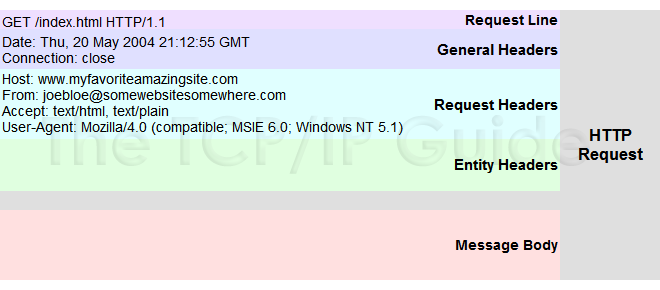
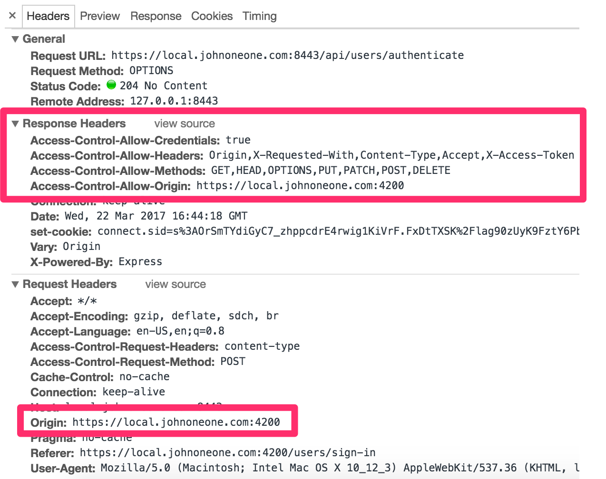
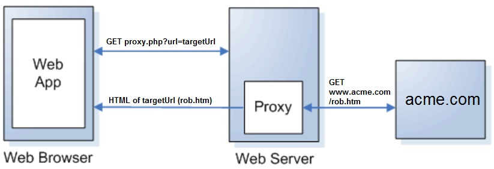
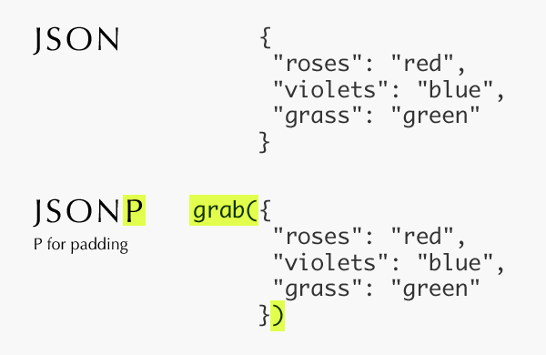

# Curso Incompany para GMV
### Git/Github, ECMA6, Patrones de diseño, AJAX avanzado, APIs externas, JS para Frontend, Fundamentos de Testing...


[FICTIZIA » Cursos a medida para empresas](https://www.fictizia.com/formacion-empresas)

## Clase 8


### ¿Cómo navegamos por internet?


- [How the Internet Works in 5 Minutes](https://www.youtube.com/watch?v=7_LPdttKXPc)
- Internet es la `red de redes`.
- Son muchos los factoes que intervienen en que internet funcione
- En su base tu ordenador (cliente) se comunica con otro ordenador (servidor)
- Y se establece un dialogo por pasos (peticion y respuesta)

**Recursos**
- [How Does the Internet Actually Work?](https://www.youtube.com/watch?v=ZonvMhT5c_Q)
- [Inside a Google data center](https://www.youtube.com/watch?v=XZmGGAbHqa0)
- [La HISTORIA de INTERNET #DiaDeInternet - Drawing Things](https://www.youtube.com/watch?v=mGG5o6vbKyQ)
- [How It Works: Internet of Things](https://www.youtube.com/watch?v=QSIPNhOiMoE)


### ¿Cómo funciona el protocolo HTTP?

**[Especificación de HTTP](https://tools.ietf.org/html/rfc2616#section-10)**

**Partes de una comunicación**


**Petición HTTP Típica**




**Respuesta HTTP Típica**


**HTTP y sus códigos**
[Lista de respuestas HTTP](https://es.wikipedia.org/wiki/Anexo:C%C3%B3digos_de_estado_HTTP)
- Por tipología:
  - 1xx Informativas
  - 2xx Peticiones Correctas
  - 3xx Redirecciones
  - 4xx Errores Cliente
  - 5xx Errores Servidor

### ¿Cómo funciona el protocolo SSL/TLS?


**Recursos**
- [HakTip - How to Capture Packets with Wireshark - Getting Started](https://www.youtube.com/watch?v=6X5TwvGXHP0)
- [Are HTTP Websites Insecure?](http://blog.securitymetrics.com/2014/08/are-http-websites-insecure.html)
- [From July, Chrome will name and shame insecure HTTP websites](https://www.theregister.co.uk/2018/02/08/google_chrome_http_shame/)
- [Google Chrome: HTTPS or bust. Insecure HTTP D-Day is tomorrow, folks](https://www.theregister.co.uk/2018/07/23/https_dday_google_chrome/)
- [Steal My Login](http://www.stealmylogin.com/)
- [Google Chrome to Label Sites Using HTTP as Insecure Starting in July](http://www.eweek.com/security/google-chrome-to-label-sites-using-http-as-insecure-starting-in-july)
- [Firefox 59: mark HTTP as insecure](https://www.ghacks.net/2017/12/14/firefox-59-mark-http-as-insecure/)

### ¿Qué es AJAX?


**Recursos**
- [A gentle Introduction to Ajax](https://codeburst.io/a-gentle-introduction-to-ajax-1e88e3db4e79)
- [AJAX Basics Explained By Working At A Fast Food Restaurant](https://blog.codeanalogies.com/2018/01/15/ajax-basics-explained-by-working-at-a-fast-food-restaurant/)

### AJAX: En la práctica

**Con Jquery**

```javascript
function peticionJqueryAjax (url) {

    $.ajax({
        dataType: "json",
        url: url,
    })
     .done(function( data, textStatus, jqXHR ) {
         console.log( "La solicitud se ha completado correctamente:", data );
     })
     .fail(function( jqXHR, textStatus, errorThrown ) {
         console.log( "La solicitud a fallado:", textStatus);
    });

}

peticionJqueryAjax ("<---URL---->");
```

**Vanilla JS**

- *readyState*:
    - 0 es *uninitialized*
    - 1 es *loading*
    - 2 es *loaded*
    - 3 es *interactive*
    - 4 es *complete*

```javascript
function peticionAjax(url) {
    var xmlHttp = new XMLHttpRequest();

    xmlHttp.onreadystatechange = function() {

        if (xmlHttp.readyState === 4 && xmlHttp.status === 200) {
            console.info(JSON.parse(xmlHttp.responseText));
        } else if (xmlHttp.readyState === 4 && xmlHttp.status === 404) {
            console.error("ERROR! 404");
            console.info(JSON.parse(xmlHttp.responseText));
        }
    };
    xmlHttp.open("GET", url, true);
    xmlHttp.send();
}

peticionAjax("<---URL---->");
```

### JSON
- Todo puede ser convertido a JSON y decodificado de vuelta
- Pero debe estar dentro de esta [especificacion ECMA-404](http://www.ecma-international.org/publications/files/ECMA-ST/ECMA-404.pdf)
- `JSON.parse()`: Analiza la cadena y retorna los valores
- `JSON.stringify()`: Analiza los valores y retorna una cadena 

```javascript

var dato = {
    "nombre": "Ulises",
    "Saludar": function () {console.log("Hola!")},
    "profe": true,
    "extras": undefined
}

var datoJSON = JSON.stringify(dato); //string -> "{"nombre":"Ulises","profe":true}"
var datoRecuperado = JSON.parse(datoJSON); //object -> {"nombre":"Ulises","profe":true}
```

**Recursos**
- [JSON en Wikiwand](http://www.wikiwand.com/es/JSON)
- [MDN | JSON.parse()](https://developer.mozilla.org/en-US/docs/Web/JavaScript/Reference/Global_Objects/JSON/parse)
- [MDN | JSON.stringify()](https://developer.mozilla.org/en-US/docs/Web/JavaScript/Reference/Global_Objects/JSON/stringify)
- [Validador: jsonformatter](https://jsonformatter.curiousconcept.com/)
- [Visor: jsonviewer](http://jsonviewer.stack.hu/)


### Trabajando con APIs y CRUD

**APIs**
> Una API es una interfaz de programación de aplicaciones (del inglés API: Application Programming Interface). Es un conjunto de rutinas que provee acceso a funciones de un determinado software.
> Son publicadas por los constructores de software para permitir acceso a características de bajo nivel o propietarias, detallando solamente la forma en que cada rutina debe ser llevada a cabo y la funcionalidad que brinda, sin otorgar información acerca de cómo se lleva a cabo la tarea. Son utilizadas por los programadores para construir sus aplicaciones sin necesidad de volver a programar funciones ya hechas por otros, reutilizando código que se sabe que está probado y que funciona correctamente. [Wikipedia](https://es.wikipedia.org/wiki/Web_API)

**CRUD**


> En informática, CRUD es el acrónimo de "Crear, Leer, Actualizar y Borrar" (del original en inglés: Create, Read, Update and Delete), que se usa para referirse a las funciones básicas en bases de datos o la capa de persistencia en un software. [Wikipedia](https://es.wikipedia.org/wiki/CRUD)

- Create:
  - Method (POST):
    - Respuesta 200 - OK
    - Respuesta 204 - Sin contenido
    - Respuesta 404 - No encontrado
    - Respuesta 409 - Conflicto, ya existe
- Read:
  - Method (GET):
    - Respuesta 200 - OK
    - Respuesta 404 - No encontrado
- Update:
  - Method (PUT):
    - Respuesta 200 - OK
    - Respuesta 204 - Sin contenido
    - Respuesta 404 - No encontrado
- Delete:
  - Method (DELETE):
    - Respuesta 200 - OK
    - Respuesta 404 - No encontrado

**REST: Transferencia de Estado Representacional**
> La transferencia de estado representacional (en inglés representational state transfer) o REST es un estilo de arquitectura software para sistemas hipermedia distribuidos como la World Wide Web. El término se originó en el año 2000, en una tesis doctoral sobre la web escrita por Roy Fielding, uno de los principales autores de la especificación del protocolo HTTP y ha pasado a ser ampliamente utilizado por la comunidad de desarrollo. [Wikipedia](https://es.wikipedia.org/wiki/Transferencia_de_Estado_Representacional)


**APIs: Ejemplos de documentación**
- [API RTVE](https://github.com/UlisesGascon/RTVE-API)
- [MARVEL Doc](https://developer.marvel.com/docs)

**APIs: Listados**
- [Public APIs](https://github.com/toddmotto/public-apis)
- [programmableweb - List](https://www.programmableweb.com/apis/directory)
- [Open APIs Wikipedia](https://en.wikipedia.org/wiki/List_of_open_APIs)
- [apilist.fun](http://apilist.fun/)

**APIs: Interesantes**
- [Shodan](https://www.shodan.io/)
- [pokeapi](http://pokeapi.co/)
- [Open Weather Map](http://openweathermap.org/)
- [Fitbit](https://dev.fitbit.com/eu)
- [Marvel](http://developer.marvel.com/)
- [SWAPI - The Star Wars API](https://swapi.co/)
- [reddit](https://www.reddit.com/dev/api)
- [Deck of Cards - API](http://deckofcardsapi.com/)
- [TheTVDB API v2](https://api-beta.thetvdb.com/swagger#/)
- [Twitter Streaming](https://dev.twitter.com/streaming/overview)
- [Guild Wars 2](https://api.guildwars2.com/v2)
- [Nutritionix API](https://www.nutritionix.com/business/api)

### CORS: Control de acceso HTTP



> El Intercambio de Recursos de Origen Cruzado (CORS) es un mecanismo que utiliza encabezados adicionales HTTP para permitir que un user agent obtenga permiso para acceder a recursos seleccionados desde un servidor, en un origen distinto (dominio), al que pertenece. Un agente crea una petición HTTP de origen cruzado cuando solicita un recurso desde un dominio distinto, un protocolo o un puerto diferente al del documento que lo generó. [MDN](https://developer.mozilla.org/es/docs/Web/HTTP/Access_control_CORS)

**Recursos**
- [Understanding CORS](https://medium.com/@baphemot/understanding-cors-18ad6b478e2b)
- [CORS Wikiwand](https://www.wikiwand.com/en/Cross-origin_resource_sharing)
- [Tutorial CORS](http://www.html5rocks.com/en/tutorials/cors/)
- [Using CORS by html5rocks](https://www.html5rocks.com/en/tutorials/cors/)
- [Control de acceso HTTP (CORS) by MDN](https://developer.mozilla.org/es/docs/Web/HTTP/Access_control_CORS)
- [Cross-origin resource sharing en Wikipedia](https://en.wikipedia.org/wiki/Cross-origin_resource_sharing)
- [Enable cross-origin resource sharing](https://enable-cors.org/)
- [crossorigin.me (Proxy)](https://crossorigin.me/)

### PROXY



**Proxy Free Online**
- [cors-anywhere](http://cors-anywhere.herokuapp.com/)
- [crossorigin.me](https://corsproxy.github.io/)

**Nodejs**
```javascript
// Crea un fichero: server.js
// En la terminal: npm install express request && node server.js
var express = require('express');
var request = require('request');
var app = express();
var path = require('path');

// Static files
app.use(express.static('public'));

// viewed at http://localhost:8080
app.get('/', function(req, res) {
    res.sendFile(path.join(__dirname + '/public/index.html'));
});

app.get('/proxy', function (req, res){
    // @Example: localhost:8080/proxy?url=http://airemad.com/api/v1/station/
    // CORS
    res.header("Access-Control-Allow-Origin", "*");
    res.header("Access-Control-Allow-Headers", "Origin, X-Requested-With, Content-Type, Accept");
    
    // PIPE Response
    request({  
        url: req.query.url,
        method: req.query.method || "GET"
    }).pipe(res)
});

app.listen(8080);
```

### JSONP




- json (formato)
```javascript
{ foo: 'bar' }
```
- callback (cliente)
```javascript
mycallback = function(data){
  alert(data.foo);
};
```
  
- peticion (cliente)
```javascript
var url = "http://www.example.net/sample.aspx?callback=mycallback";
```
  
- respuesta (servidor)
```javascript
mycallback({ foo: 'bar' });
```

- Ejemplo de CORS y JSONP con [php de formandome](http://www.formandome.es/javascript/cors-vs-jsonp-solicitudes-ajax-entre-dominios/)
```php
<?php
header('content-type: application/json; charset=utf-8');
header("access-control-allow-origin: *");
 
//Cadena de conexión:
$connect = mysql_connect("localhost", "usuario", "pwd")
or die('Could not connect: ' . mysql_error());
 
//seleccionamos bbdd:
$bool = mysql_select_db("database", $connect);
if ($bool === False){
   print "No puedo encontrar la bbdd: $database";
}
 
//inicializamos el cliente en utf-8:
mysql_query('SET names utf8');

$query = "SELECT * FROM futbolistas";
 
$result = mysql_query($query) or die("SQL Error: " . mysql_error());
$data = array();
// obtenemos los datos:
while ($row = mysql_fetch_array($result, MYSQL_ASSOC)) {
    $data[] = array(
        'id' => $row['id'],
        'nombre' => $row['nombre'],
        'apellido' => $row['apellido'],
        'posicion' => $row['posicion'],
        'equipo' => $row['equipo'],
        'dorsal' => $row['dorsal'],
        'desc' => $row['desc'],
	'imagen' => $row['imagen']
      );
}
 
//codificamos en json:
$json = json_encode($data);
 
//enviamos json o jsonp según venga o no una función de callback:
echo isset($_GET['callback'])
    ? "{$_GET['callback']}($json)"
    : $json;
?>
```

- Ejemplo con [Nodejs](http://expressjs.com/api.html#res.jsonp)
```javascript
var express = require('express');
var app = express();

app.get('/endpointJSON', function(req, res){
    console.log('JSON response');
    console.log(req.query);
    res.json(req.query);
});
 
app.listen(3000);
```


Soporte en cliente (librerías):
- Jquery:
  ```javascript
    // Using YQL and JSONP
    $.ajax({
        url: "http://query.yahooapis.com/v1/public/yql",
        jsonp: "callback",
        dataType: "jsonp",
        data: {
            q: "select title,abstract,url from search.news where query=\"cat\"",
            format: "json"
        },
        success: function( response ) {
            console.log( response ); // server response
        }
    });  
  ```

**Librerías**
- [jsonp.js de Przemek Sobstel](https://github.com/sobstel/jsonp.js/blob/master/jsonp.js)
- [J50Npi.js de Roberto Decurnex](https://github.com/robertodecurnex/J50Npi/blob/master/J50Npi.js)

**Recursos**
- [Is JSONP safe to use?](https://stackoverflow.com/questions/613962/is-jsonp-safe-to-use)
- [Using JSONP Safely](https://www.metaltoad.com/blog/using-jsonp-safely)
- [Practical JSONP Injection](https://securitycafe.ro/2017/01/18/practical-jsonp-injection/)
- [JSONP for cross-site Callbacks](https://weblog.west-wind.com/posts/2007/Jul/04/JSONP-for-crosssite-Callbacks)
- [(in)Security of JSONP: CSRF risks](https://phocean.net/2013/10/13/csrf-with-jsonp.html)


### Herramientas esenciales
- [Insomnia](https://insomnia.rest/)
- [Jsonviewer](http://jsonviewer.stack.hu/)
- [Postman](https://chrome.google.com/webstore/detail/postman/fhbjgbiflinjbdggehcddcbncdddomop)

### Ajax avanzado

### Ajax avanzado: Verbos HTTP

**JSON remplazando formularios**

```html
<form action="/action_page.php" method="post" enctype="application/x-www-form-urlencoded">
	<input type="text" name="name" placeholder="First name">
	<input type="submit" value="Enviar">
</form>
```

```javascript
var nombreDato = 'Yo mismo';
var xhr = new XMLHttpRequest();
xhr.open('POST', '/action_page.php');
xhr.setRequestHeader('Content-Type', 'application/x-www-form-urlencoded');
xhr.onload = function() {
    if (xhr.status === 200 && xhr.responseText !== nombreDato) {
        console.log('Todo bien! Respuesta:', xhr.responseText);
    }
    else if (xhr.status !== 200) {
        console.log('Algo va mal. Codigo de estado:', xhr.status);
    }
};
xhr.send(encodeURI('name=' + nombreDato));

```

**Mandar un JSON limpio vía POST**
```javascript
var nombreDato = 'Yo mismo';
var xhr = new XMLHttpRequest();
xhr.open('POST', '/action_page.php');
xhr.setRequestHeader('Content-Type', 'application/json');
xhr.onload = function() {
    if (xhr.status === 200) {
        console.log("respuesta:", JSON.parse(xhr.responseText));
    }
};

xhr.send(JSON.stringify({
  "name": nombreDato
}));
```


### Ajax avanzado: Cabeceras personalizadas y credenciales

```javascript
var xhr = new XMLHttpRequest();
xhr.open('POST', 'http://someotherdomain.com');
xhr.withCredentials = true; // Cookies
xhr.setRequestHeader('Content-Type', 'text/plain'); // header personal
xhr.onload = function() {
    if (xhr.status === 200) {
        console.log("respuesta:", JSON.parse(xhr.responseText));
    }
};
xhr.send('sometext');
```

**Recursos**
- [XMLHttpRequest.withCredentials](https://developer.mozilla.org/en-US/docs/Web/API/XMLHttpRequest/withCredentials)
- [XMLHttpRequest.setRequestHeader()](https://developer.mozilla.org/en-US/docs/Web/API/XMLHttpRequest/setRequestHeader)
- [Forbidden response header name](https://developer.mozilla.org/en-US/docs/Glossary/Forbidden_response_header_name)
- [Forbidden header name](https://developer.mozilla.org/en-US/docs/Glossary/Forbidden_header_name)


### Ajax: FormData, una gran incentivo

Ejemplo sencillo
```javascript
var formData = new FormData();

formData.append("usuario", "Ulises");
formData.append("id", 123456); // todo se convierte a String

// Contenido desde un <input type="file"> desde el HTML
formData.append("fichero1", fileInputElement.files[0]);

// Fichero creado al vuelo con JavaScript
var content = '<a id="a"><b id="b">hey!</b></a>'; // El contenido del nuevo fichero
var blob = new Blob([content], { type: "text/xml"});

formData.append("otro_fichero", blob);

var request = new XMLHttpRequest();
request.open("POST", "http://myserver.com/submitData");
request.send(formData);
```

Ejemplo partiendo de un formulario existente
```javascript
// Trae el formulario del HTML
var formElement = document.getElementById("myFormElement");
formData = new FormData(formElement);
//Añade más información
formData.append("serialnumber", serialNumber++);
//Enviando los datos...
var request = new XMLHttpRequest();
request.open("POST", "http://myserver.com/submitData");
request.send(formData);
```

**Recursos**
- [Usando Objetos FormData](https://developer.mozilla.org/es/docs/Web/Guide/Usando_Objetos_FormData)
- [Uploading Files with AJAX](http://blog.teamtreehouse.com/uploading-files-ajax)


### Ajax avanzado: Otros usos

**Usando eventos y más...**
```javascript
var request = new XMLHttpRequest();

// Seleccionamos un fichero para subir
data.append('file', document.querySelector('#upload-file').files[0]);

request.addEventListener('load', function(e) {
	console.log("Content-Type:", request.getResponseHeader("Content-Type"))
	console.log(request.response);
});

// Gestión del progreso de subida....
request.upload.addEventListener('progress', function(e) {
	var percent_complete = (e.loaded / e.total)*100;
	console.log("Llevamos un", percent_complete+"%");
});

// Ajustamos la respuesta del servidor a fichero json, evitando la codificación errónea
request.responseType = 'json';
request.open('post', 'upload.php'); 
request.send(data);
```

**Abortar la carga**
```javascript
var xhr = new XMLHttpRequest(),
    method = "GET",
    url = "https://fictizia.com/";
xhr.open(method, url, true);

xhr.send();

if (condicion) {
  xhr.abort();
}
```

**Un mundo de posibilidades...**
- [XMLHttpRequest.responseXML](https://developer.mozilla.org/en-US/docs/Web/API/XMLHttpRequest/responseXML)
- [XMLHttpRequest.responseType](https://developer.mozilla.org/en-US/docs/Web/API/XMLHttpRequest/responseType)
- [XMLHttpRequest.upload](https://developer.mozilla.org/en-US/docs/Web/API/XMLHttpRequest/upload)
- [XMLHttpRequest.timeout](https://developer.mozilla.org/en-US/docs/Web/API/XMLHttpRequest/timeout)
- [XMLHttpRequest.getAllResponseHeaders()](https://developer.mozilla.org/en-US/docs/Web/API/XMLHttpRequest/getAllResponseHeaders)
- [XMLHttpRequest.getResponseHeader()](https://developer.mozilla.org/en-US/docs/Web/API/XMLHttpRequest/getResponseHeader)
- [XMLHttpRequest.overrideMimeType()](https://developer.mozilla.org/en-US/docs/Web/API/XMLHttpRequest/overrideMimeType)


### Seguridad AJAX

```javascript
// service.com/hacked 
// {data:"<script>alert("¡Sorpresa!")</script>"}

var xhr = new XMLHttpRequest();
xhr.open('GET', 'http://service.com/hacked');
xhr.onload = function() {
    if (xhr.status === 200) {
    	var respuesta = JSON.parse(xhr.responseText)
        console.log("respuesta:", respuesta);
        document.body.innerHtml = respuesta.data
    }
};
xhr.send();
```

**Normas básicas**
- Usar `innerText` y no `innerHtml`
- Nunca jamas usar `eval`
- Nunca encriptar en cliente
- No confies en la lógica del front

**Recursos**

- [Is Your Website Hackable?](https://www.acunetix.com/websitesecurity/ajax/)
- [AJAX Security Cheat Sheet](https://www.owasp.org/index.php/AJAX_Security_Cheat_Sheet)
- [Testing for AJAX Vulnerabilities (OWASP-AJ-001)](https://www.owasp.org/index.php/Testing_for_AJAX_Vulnerabilities_(OWASP-AJ-001))
- [Understanding Ajax vulnerabilities](https://www.ibm.com/developerworks/library/wa-vulnerabilities/index.html)

### Datos Abiertos

- [Portal de datos abiertos del Ayuntamiento de Madrid](http://datos.madrid.es/portal/site/egob/)
- [Iniciativa de datos abiertos del Gobierno de España](http://datos.gob.es/)
- [EMT Datos Abiertos](http://opendata.emtmadrid.es/)
- [European Data Portal](https://www.europeandataportal.eu/)
- [Open NASA](https://open.nasa.gov/open-data/)
- [Datos Abiertos de Mexico](https://datos.gob.mx/)
- [The home of the U.S. Government’s open data](https://www.data.gov/)


### Fetch, una alternativa a XMLHttpRequest
- [Compatibilidad nula con IE11](https://caniuse.com/#search=fetch)
- Se hace uso de [promesas](https://developer.mozilla.org/es/docs/Web/JavaScript/Guide/Usar_promesas) y se puede escalar con [Async/Await](https://developer.mozilla.org/es/docs/Web/JavaScript/Referencia/Sentencias/funcion_asincrona)
- Puede gestionar llamadas sin soporte a CORS
- Las peticiones no pueden ser paradas


**GET básico**
```javascript
function ajaxHandler (url, cb){
  fetch(url)
    .then(function(response) {
      return response.json();
    })
    .then(function(data) {
      cb(data)  
    })
    .catch(function(error) {
      console.log(error)
    });  
}

ajaxHandler("http://airemad.com/api/v1/station", function(data){
    console.log("Data:", data)
})
```

**Multimedia**
```javascript
var myImage = document.querySelector('.my-image');
fetch('flowers.jpg').then(function(response) {
  return response.blob();
}).then(function(blob) {
  var objectURL = URL.createObjectURL(blob);
  myImage.src = objectURL;
});
```

**La mágia es `Request`**

```javascript
var request = new Request('http://fictizia.com/subir', {
	method: 'POST', 
	mode: 'no-cors', 
	redirect: 'follow',
	headers: new Headers({
		'Content-Type': 'text/plain',
		'X-My-Custom-Header': 'CustomValue'
	})
});

fetch(request).then(function() { //Gestión de la respuesta });
```

**Subir los datos de un formulario**
```javascript
fetch('https://davidwalsh.name/submit', {
	method: 'post',
	body: new FormData(document.getElementById('comment-form'))
});

```


**Documentacion**
- [Response()](https://developer.mozilla.org/en-US/docs/Web/API/Response/Response)
- [Response.redirected](https://developer.mozilla.org/en-US/docs/Web/API/Response/redirected)
- [Response.clone()](https://developer.mozilla.org/en-US/docs/Web/API/Response/clone)
- [Response.status](https://developer.mozilla.org/en-US/docs/Web/API/Response/status)
- [Response.statusText](https://developer.mozilla.org/en-US/docs/Web/API/Response/statusText)
- [Response.type](https://developer.mozilla.org/en-US/docs/Web/API/Response/type)
- [Response.headers](https://developer.mozilla.org/en-US/docs/Web/API/Response/headers)
- [Body.bodyUsed](https://developer.mozilla.org/en-US/docs/Web/API/Body/bodyUsed)
- [Body.body](https://developer.mozilla.org/en-US/docs/Web/API/Body/body)
- [Body.text()](https://developer.mozilla.org/en-US/docs/Web/API/Body/text)
- [Body.json()](https://developer.mozilla.org/en-US/docs/Web/API/Body/json)
- [Body.formData()](https://developer.mozilla.org/en-US/docs/Web/API/Body/formData)
- [Body.blob()](https://developer.mozilla.org/en-US/docs/Web/API/Body/blob)
- [Body.arrayBuffer()](https://developer.mozilla.org/en-US/docs/Web/API/Body/arrayBuffer)
- [Response.ok](https://developer.mozilla.org/en-US/docs/Web/API/Response/ok)
- [Response.error()](https://developer.mozilla.org/en-US/docs/Web/API/Response/error)

**Recursos**
- [Fetch API by DWB](https://davidwalsh.name/fetch)
- [Introduction to fetch() By Matt Gaunt](https://developers.google.com/web/updates/2015/03/introduction-to-fetch)
- [This API is so Fetching! by Mozilla Hacks](https://hacks.mozilla.org/2015/03/this-api-is-so-fetching/)
- [That's so fetch! by Jake Archibald](https://jakearchibald.com/2015/thats-so-fetch/)
- [Can I use? Fetch](http://caniuse.com/#search=fetch)
- [Basics: Using AJAX with Fetch API](https://medium.com/letsboot/basics-using-ajax-with-fetch-api-b2218b0b9691)
- [Fetch: Polyfill](https://github.com/github/fetch)


### Ejercicios

**1 -** Sacar en el html los [datos de polen](http://airemad.com/api/v1/pollen).

```javascript
var xmlHttp = new XMLHttpRequest();
xmlHttp.onreadystatechange = function() {

  if (xmlHttp.readyState === 4 && xmlHttp.status === 200) {
      var datos = (JSON.parse(xmlHttp.responseText));

      var contenido = "";
      datos.forEach(function(estacion) {
          contenido += "<h1>" + estacion.name + " (" + estacion.id + ")</h1>"
          contenido += "<ul>"

          for (var medicion in estacion.mediciones) {
              contenido += "<li>" + medicion + ": <i>" + estacion.mediciones[medicion]["resumen"] + "</i></li>"
          }

          contenido += "</ul>"
      })
      document.body.innerHTML = contenido;
  } else if (xmlHttp.readyState === 4 && xmlHttp.status === 404) {
      console.error("ERROR! 404");
      console.info(JSON.parse(xmlHttp.responseText));
  }
};

xmlHttp.open("GET", "http://airemad.com/api/v1/pollen", true);
xmlHttp.send();
```

**2 -** Sacar en el html el tiempo meteorológico de Madrid, Barcelona y Valencia. 
Nota: http://openweathermap.org te será de gran ayuda, busca la solución al error 401


```javascript
	var contenido = "";
  	function temperaturaCiudad (ciudad) {
        var xmlHttp = new XMLHttpRequest(),
        APIKey = '', // Puedes usar una cuenta gratuita -> http://openweathermap.org/price
        cURL = 'http://api.openweathermap.org/data/2.5/weather?q='+ciudad+'&APPID='+APIKey;
    
        xmlHttp.onreadystatechange = function () {
            if (xmlHttp.readyState === 4 && xmlHttp.status === 200) {
                var datos = (JSON.parse(xmlHttp.responseText));
	              contenido += "<h1>"+datos.name+"</h1>"
	              contenido += "<p>"+datos.weather[0].description+"</p>"
	              document.body.innerHTML = contenido;
            } else if (xmlHttp.readyState === 4 && xmlHttp.status === 404) {
                datos = JSON.parse(xmlHttp.responseText);
                console.error("ERROR! 404");
                console.info(datos);
            }
        };
    
        xmlHttp.open( "GET", cURL, true );
        xmlHttp.send();
    }
    
    temperaturaCiudad("Madrid");
    temperaturaCiudad("Barcelona");
    temperaturaCiudad("Valencia");
```

**3 -** Jugando con [datos abiertos](http://datos.gob.es/), saquemos los detalles de todos los cuadros eléctricos de Gijón por consola.


```javascript
    // Tu solución
```

```
// Podemos encontrar errores en las respuestas.
// cuadromando[5] ...

    calle: "Faustina &#193;lvarez Garc&#237;a"
    latitud: 43.526376045
    longitud: -5.685764873
    numero: ""
    potencia_w_: 17321

// ...
```